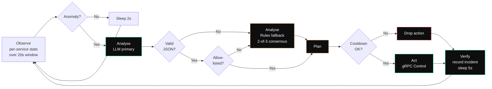
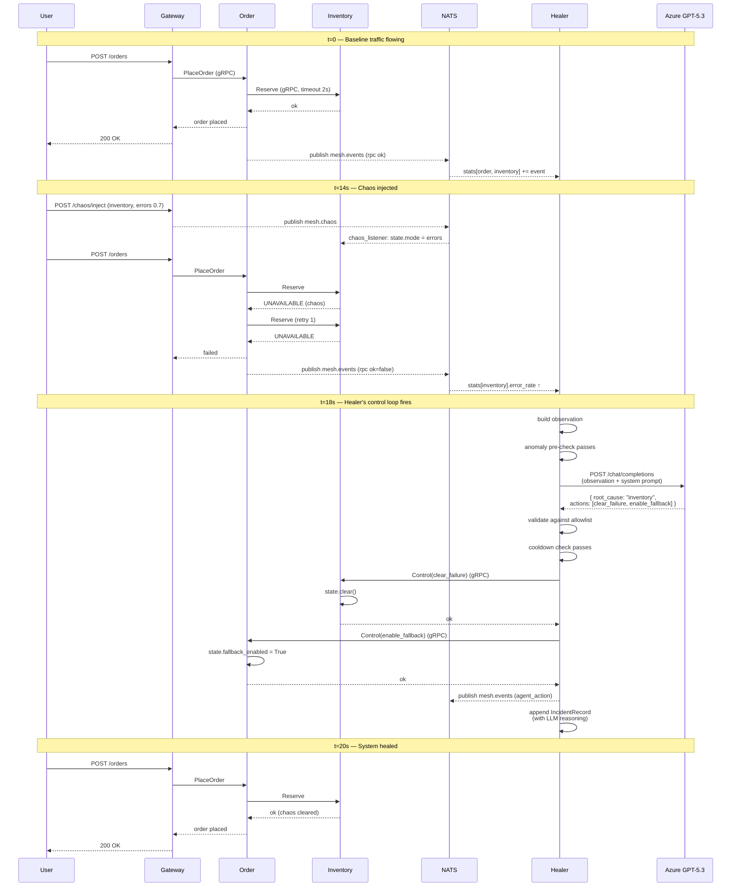
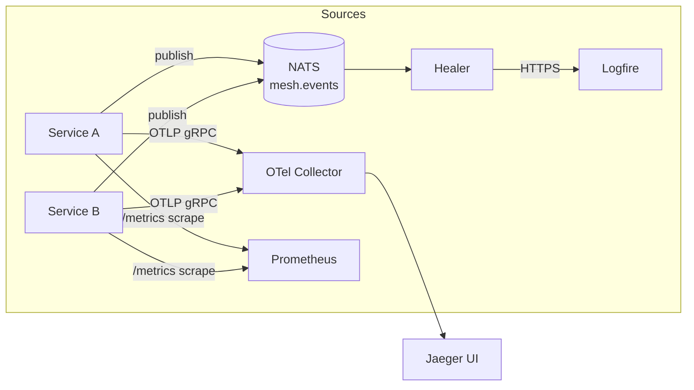

<div align="center">

# Mesh Control

### Self-Healing Microservice Mesh with AI-Driven Root Cause Analysis

*A graduate-level distributed systems study in autonomous remediation: a gRPC service mesh that observes itself, identifies the deepest failing dependency in its call graph, and applies bounded remediation actions — with an LLM driving reasoning and a deterministic rule engine guaranteeing safety.*

---

[](https://www.python.org/)
[](https://fastapi.tiangolo.com/)
[](https://grpc.io/)
[](https://react.dev/)
[](https://vitejs.dev/)
[](https://docs.docker.com/compose/)
[](https://opentelemetry.io/)
[](https://www.jaegertracing.io/)
[](https://prometheus.io/)
[](https://nats.io/)
[](https://etcd.io/)
[](https://pydantic.dev/logfire/)
[](./LICENSE)
[]()

</div>

---

## Team

| Member | SJSU ID | Primary contribution areas |
|---|---|---|
| **Vineet Kumar** ([@vineetkia](https://github.com/vineetkia)) | 019140433 | Repository bootstrap and Docker Compose orchestration, gRPC proto contracts and shared package layout, retry/timeout/circuit-breaker resilience primitives, dependency-graph root-cause analysis algorithm, bounded remediation command surfaces, React + Vite dashboard shell, dependency graph SVG visualization, flow selector and flow API client, incident history and shortcut overlay UI, Prometheus + OpenTelemetry collector configs, demo + failure-injection scripts, enterprise-grade README. |
| **Samved Sandeep Joshi** ([samvedsandeep.joshi@sjsu.edu](mailto:samvedsandeep.joshi@sjsu.edu)) | 019100107 | Baseline auth and notification gRPC handlers, order orchestration across checkout dependencies, payments + fraud + shipping + inventory + recommendation services, service health cards + top bar + base dashboard layout, traffic generator UI + polling hook, chaos injector controls + API hook, capitalized chaos panel labels + tooltips, flow exerciser + drill-call hook + walkthrough UI, traffic/chaos panel height alignment, frontend + gateway configuration for AWS deployment, hosted-env Dockerfiles + compose settings, registration + profile + notification proto fields, backend registration/profile/notification storage flows, landing/login/register/profile pages, auth + route + notification hooks + bell, integrated React auth flow replacing static pages. |
| **Girith Choudhary** ([girithmchoudhary@gmail.com](mailto:girithmchoudhary@gmail.com)) | 018281744 | Gateway REST facade over the gRPC mesh, gateway flow execution + command + service health clients, healer agent event ingestion + mesh state tracking, Google OAuth integration + authentication config, service instrumentation with OpenTelemetry and Logfire, GCP VM deployment compose + setup scripts, Vercel + Render + GCP deployment documentation, Azure VM scripts (create/start/stop/delete) + Docker install bootstrap, Azure Container Apps deployment script + guide, Azure Prometheus + OTel collector containers, plain-English incident summaries + dashboard explanation helpers, dashboard observability cards + service drill panels, healer decisions + telemetry context surfacing on the frontend, blast-radius diagram in expanded incident history, Azure Container Apps image-refresh deployment update. |

> **Instructor:** Prof. **Rakesh Ranjan** · *San José State University · Department of Computer Engineering · CMPE-273: Enterprise Distributed Systems · Spring 2026*

---

## Table of Contents

1. [The Problem](#the-problem)
2. [What This Project Is](#what-this-project-is)
3. [Architecture at a Glance](#architecture-at-a-glance)
4. [Six Real E-Commerce Flows](#six-real-e-commerce-flows)
5. [The Healing Agent](#the-healing-agent)
6. [Distributed-Systems Concepts Demonstrated](#distributed-systems-concepts-demonstrated)
7. [Quick Start](#quick-start)
8. [Demo Walkthrough](#demo-walkthrough)
9. [Repository Layout](#repository-layout)
10. [API Reference](#api-reference)
11. [Observability Stack](#observability-stack)
12. [Failure Injection Reference](#failure-injection-reference)
13. [Testing](#testing)
14. [Engineering Decisions & Tradeoffs](#engineering-decisions--tradeoffs)

---

## The Problem

When a microservice fails in production today, the chain of events is well-known:

> **PagerDuty fires → an SRE wakes up → opens five dashboards → runs `kubectl get pods` → traces a request through Datadog → identifies the bad service → restarts it.**
>
> Industry mean time to recovery: **~27 minutes** *(Google SRE 2023 incident report)*.

Every step is mechanical. The bottleneck is human reaction time. This project asks: **what if the SRE never went home?**

We built a service mesh that:
- detects failures **in under 5 seconds** via 2-of-3 statistical consensus,
- distinguishes **symptom from root cause** by walking the dependency graph,
- applies **bounded remediation actions** to heal the system,
- and does it all **autonomously, in under 10 seconds** end-to-end.

---

## What This Project Is

A complete, graduate-level distributed-systems demo in 16 Docker containers. Designed to be:

- **Runnable on a laptop** — `make up` brings the entire stack online.
- **Demonstrably correct** — six real e-commerce flows, each with its own curated failure profile, recover automatically.
- **Architecturally honest** — every distributed-systems concept on the CMPE-273 syllabus is exercised in production-grade code: discovery, gRPC, retries, timeouts, circuit breakers, distributed tracing, telemetry streaming, consensus signal validation, dependency-graph reasoning, autonomous remediation.
- **AI-grounded but safe** — the healing agent uses a real LLM (Azure GPT-5.3) for diagnosis, but the action surface is a four-verb allowlist guarded by a 12-second cooldown and a hot deterministic fallback. The LLM cannot crash the system, take unauthorised actions, or block recovery if it goes down.

---

## Architecture at a Glance

### High-level component diagram

```mermaid
flowchart TB
    subgraph UI["UI Plane"]
        Browser[/"React UI :5173<br/>Mesh Control Dashboard"/]
    end

    subgraph CtrlPlane["Control Plane"]
        Gateway["API Gateway :8080<br/>FastAPI · REST → gRPC"]
        Healer["Healing Agent :8090<br/>Observe → Analyse → Plan → Act → Verify"]
    end

    subgraph DataPlane["Data Plane (gRPC, port 5005x)"]
        direction LR
        Order["order :50052"]
        Auth["auth :50051"]
        Inv["inventory :50053"]
        Notif["notification :50054"]
        Pay["payments :50055"]
        Fraud["fraud :50056"]
        Ship["shipping :50057"]
        Rec["recommendation :50058"]
    end

    subgraph Infra["Infrastructure Plane"]
        Etcd["etcd :2379<br/>Service Registry"]
        NATS["NATS :4222<br/>mesh.events · mesh.chaos"]
        OTel["OTel Collector :4317"]
        Jaeger["Jaeger :16686<br/>Distributed Traces"]
        Prom["Prometheus :9090<br/>Metrics"]
        LLM["Azure GPT-5.3<br/>(via OpenAI-compatible REST)"]
        Logfire["Pydantic Logfire<br/>(LLM call telemetry)"]
    end

    Browser -->|HTTP REST + JSON| Gateway
    Browser -.->|poll 1.5s| Healer

    Gateway -->|gRPC| Order
    Order -->|gRPC| Auth
    Order -->|gRPC| Inv
    Order -->|gRPC| Notif
    Order -->|gRPC| Pay
    Order -->|gRPC| Fraud
    Order -->|gRPC| Ship
    Rec -->|gRPC| Inv

    Order -.->|register| Etcd
    Auth -.->|register| Etcd
    Inv -.->|register| Etcd
    Notif -.->|register| Etcd
    Pay -.->|register| Etcd
    Fraud -.->|register| Etcd
    Ship -.->|register| Etcd
    Rec -.->|register| Etcd
    Gateway -.->|lookup| Etcd
    Healer -.->|lookup| Etcd

    Order -.->|publish events| NATS
    Auth -.->|publish events| NATS
    Inv -.->|publish events| NATS
    Notif -.->|publish events| NATS
    Pay -.->|publish events| NATS
    Fraud -.->|publish events| NATS
    Ship -.->|publish events| NATS
    Rec -.->|publish events| NATS

    NATS -.->|mesh.events| Healer
    NATS -.->|mesh.chaos| Auth
    NATS -.->|mesh.chaos| Inv
    NATS -.->|mesh.chaos| Notif
    NATS -.->|mesh.chaos| Pay
    NATS -.->|mesh.chaos| Fraud
    NATS -.->|mesh.chaos| Ship
    NATS -.->|mesh.chaos| Rec
    NATS -.->|mesh.chaos| Order

    Healer -->|gRPC Control| Auth
    Healer -->|gRPC Control| Order
    Healer -->|gRPC Control| Inv
    Healer -->|gRPC Control| Notif
    Healer -->|gRPC Control| Pay
    Healer -->|gRPC Control| Fraud
    Healer -->|gRPC Control| Ship
    Healer -->|gRPC Control| Rec

    Order -.->|OTLP traces| OTel
    Gateway -.->|OTLP traces| OTel
    Healer -.->|OTLP traces| OTel
    OTel -->|forward| Jaeger

    Healer -.->|prompt + token usage| Logfire
    Healer -->|HTTPS POST| LLM

    Prom -.->|scrape| Order
    Prom -.->|scrape| Gateway

    classDef edge fill:#0e0e0e,stroke:#00E08A,color:#fff
    classDef core fill:#0e0e0e,stroke:#888,color:#fff
    classDef infra fill:#131313,stroke:#444,color:#aaa
    class Gateway,Healer edge
    class Order,Auth,Inv,Notif,Pay,Fraud,Ship,Rec core
    class Etcd,NATS,OTel,Jaeger,Prom,LLM,Logfire infra
```



### Three planes of communication

The system has three orthogonal channels — this separation is the architectural backbone:

| Plane | Transport | Direction | Purpose |
|---|---|---|---|
| **Request** | gRPC | caller → callee (synchronous) | Real work: place orders, validate tokens, reserve stock |
| **Side channel** | NATS | many → many (async pub/sub) | Telemetry events, chaos injection commands |
| **Out-of-band trace** | OTLP/gRPC | service → collector | Distributed tracing, no business logic depends on it |

The healing agent is a **subscriber** on the side channel, not a proxy on the request path. Even if the agent crashes, user-facing requests keep flowing — they just don't get auto-remediated.

### ASCII fallback (terminal-friendly)

```
                       ┌──────────────────┐
                       │  React UI :5173  │  Mesh Control Dashboard
                       └────────┬─────────┘
                                │ HTTP (REST + JSON)
                  ┌─────────────┴─────────────┐
                  ▼                           ▼
          ┌──────────────┐            ┌──────────────┐
          │ Gateway:8080 │            │ Healer :8090 │
          │  (FastAPI)   │            │  (FastAPI)   │
          └──────┬───────┘            └──────┬───────┘
                 │ gRPC                      │ gRPC (Control)
                 ▼                           │
          ┌─────────────┐                    │
          │ Order:50052 │◄───────────────────┤
          └──┬───┬───┬──┘                    │
       gRPC  │   │   │                       │
        ┌────┘   │   └────┐                  │
        ▼        ▼        ▼                  │
   ┌─────────┐ ┌────────┐ ┌─────────────┐    │
   │Auth     │ │Invento │ │Notification │◄───┤
   │:50051   │ │ry:50053│ │:50054       │    │
   └─────────┘ └────────┘ └─────────────┘    │
                                              │
   ┌─────────┐ ┌────────┐ ┌─────────────┐    │
   │Payments │ │Fraud   │ │Shipping     │◄───┤
   │:50055   │ │:50056  │ │:50057       │    │
   └─────────┘ └────────┘ └─────────────┘    │
                                              │
                ┌───────────────────┐         │
                │ Recommendation    │◄────────┘
                │ :50058 → Inventory│
                └───────────────────┘

Infra: etcd:2379  ·  NATS:4222  ·  OTel:4317 → Jaeger:16686  ·  Prometheus:9090
```

---

## Six Real E-Commerce Flows

Each flow exercises a different subset of services with realistic call patterns. Each has its own curated failure profile that triggers the agent in a single click.

| # | Flow | HTTP Endpoint | Service Hops | Curated Failure (Demo Button) |
|---|---|---|---|---|
| 1 | **Checkout** | `POST /checkout` | gateway → order → auth → inventory → fraud → payments → shipping → notification | `errors` on **payments** at 70% rate |
| 2 | **Refund** | `POST /refund` | gateway → order → auth → payments → inventory → notification | `errors` on **payments** at 60% rate |
| 3 | **Cart Merge** | `POST /cart/merge` | gateway → order → auth → inventory | `latency` of 1700 ms on **inventory** |
| 4 | **Restock** | `POST /inventory/restock` | gateway → auth → inventory → recommendation | `errors` on **recommendation** at 60% rate |
| 5 | **Fraud Review** | `POST /fraud/review` | gateway → order → auth → fraud → notification | `grey` on **fraud** (50% errors + 700 ms) |
| 6 | **Recommendations** | `GET /recommendations/{user}` | gateway → recommendation → inventory | `errors` on **recommendation** at 70% rate |

For every flow, the healing agent correctly identifies the right root cause within 5 seconds and applies remediation within 10.

---

## The Healing Agent

### The control loop



### Two reasoning paths, one safety boundary

| | **Primary: LLM** | **Fallback: Rules** |
|---|---|---|
| Engine | Azure GPT-5.3 (via OpenAI-compatible REST) | Deterministic Python |
| Triggers | Whenever anomaly pre-check passes | Whenever LLM call fails (timeout, malformed JSON, disallowed action) |
| Reasoning | Free-form analysis of telemetry snapshot | 2-of-3 consensus: `error_rate ≥ 0.20 ∨ p95_latency_ms ≥ 800 ∨ health ∈ {degraded, unreachable}` |
| Output | Structured JSON: `{root_cause, suspects, symptoms, reasoning, actions[]}` | Same JSON shape via deepest-suspect graph walk |
| Safety | Output validated against allowlist before execution | N/A — generates only allowlisted actions by construction |
| Latency | 1.5 – 5 seconds | < 50 ms |
| Determinism | Probabilistic | Fully deterministic |

### The action surface

The healer can only invoke four verbs, and only on services that exist in the topology:

| Action | Effect | Used When |
|---|---|---|
| `clear_failure` | Resets the target's `FailureState` (simulated restart) | Root cause identified |
| `enable_fallback` | Tells upstream to degrade gracefully when downstream is bad | Direct upstream of root cause |
| `disable_fallback` | Returns to the primary path | Downstream has recovered |
| `mark_degraded` | Flags a service as serving partial responses | Visible to upstream routers |

Combined with a **12-second per-service cooldown** and an **action allowlist**, this means a misbehaving LLM can:
- ❌ Crash the system *(no — agent is a subscriber, not a proxy)*
- ❌ Take an unauthorised action *(no — allowlist rejects everything outside the four verbs)*
- ❌ Cause action storms *(no — cooldown blocks repeats)*
- ✅ Fail to choose a *good* action — in which case the rules pick up

### Logfire telemetry on every reasoning call

Every `llm_diagnose` call ships a span to Pydantic Logfire with:

- **Input observation** (per-service metrics snapshot)
- **Prompt + completion token counts** (cost telemetry)
- **Azure round-trip latency**
- **Validated decision** (or rejection reason)
- **Downstream gRPC `send_control` calls** as child spans

The IncidentCard in the dashboard renders these inline so the audience can see the cost and latency of every autonomous decision in real time.

---

## Distributed-Systems Concepts Demonstrated

Mapped against the CMPE-273 syllabus:

| Concept | Implementation | Source File |
|---|---|---|
| **Service discovery** | etcd put/get with bare-DNS fallback | `shared/discovery.py` |
| **Health checking** | Every service exposes a `Health()` gRPC; healer polls every 2 s | All `services/*/main.py` |
| **Retries with exponential backoff** | 3 attempts at 100 ms · 200 ms · 400 ms | `shared/resilience.py` |
| **Per-call timeouts** | `stub.X(req, timeout=N)` on every downstream call | `services/order/main.py` |
| **Circuit breaker** | Counter-based: closed → open after 4 failures → half-open after 8 s → closed after 2 successes | `shared/resilience.py` |
| **Distributed tracing** | OpenTelemetry → Collector → Jaeger; auto-instruments gRPC client/server | `shared/telemetry.py` |
| **Metrics** | Prometheus client lib + scraper, 5 s interval | `observability/prometheus.yml` |
| **Telemetry streaming** | NATS subject `mesh.events` (rpc results, circuit opens, downstream errors) | `shared/telemetry.py` + every service |
| **Failure injection** | NATS subject `mesh.chaos` (latency / errors / grey) with auto-expiry | `shared/chaos_listener.py` + `shared/failure_modes.py` |
| **Dependency graph** | Static topology in healer; transitive walk for victim detection | `agents/healer/main.py:DEPENDENCIES` |
| **Consensus signal validation** | 2-of-3 across error rate, p95 latency, and health status | `agents/healer/main.py:is_suspect` |
| **Symptom vs root cause** | Deepest suspect (no failing dependency below) is the root | `agents/healer/main.py:find_root_cause` |
| **LLM-driven RCA + safety** | Azure GPT-5.3 with allowlist, cooldown, and rule-based fallback | `agents/healer/main.py:llm_diagnose` |
| **Self-healing actions** | gRPC `Control()` rpc on every service | All `services/*/main.py:Control` |
| **Graceful degradation** | Order returns `ord-deferred-…` when inventory circuit is open and fallback enabled | `services/order/main.py:PlaceOrder` |
| **Pydantic Logfire instrumentation** | `incident_iteration`, `llm_diagnose`, `send_control` spans with token usage | `agents/healer/main.py:_lf_span` |

---

## Quick Start

### Prerequisites

- **Docker Desktop 24+** with Docker Compose v2
- **~3 GB free disk** (image layers + node_modules)
- **Ports** open on localhost: `5173, 8080, 8090, 16686, 9090, 2379, 4222, 4317, 9101–9108`

### Three commands

```bash
git clone git@github.com:vineetkia/CMPE-273-Self-Healing-Microservice-Mesh-Final-Project.git mesh
cd mesh
cp .env.example .env       # fill in OPENAI_* + LOGFIRE_TOKEN to enable AI agent
make up                    # docker compose up --build -d  (16 containers)
make smoke                 # basic end-to-end health check
```

### Endpoints

| URL | Purpose |
|---|---|
| **<http://localhost:5173>** | **Mesh Control dashboard** |
| <http://localhost:8080/docs> | Gateway API (FastAPI Swagger) |
| <http://localhost:8090/state> | Healer state JSON |
| <http://localhost:16686> | Jaeger (distributed traces) |
| <http://localhost:9090> | Prometheus (metrics) |

### Configuration

`.env` accepts:

```ini
# Optional: enables LLM-driven RCA via an OpenAI-compatible endpoint
# (Azure AI Foundry, OpenAI, Anthropic Claude via proxy, etc.)
OPENAI_API_KEY=
OPENAI_BASE_URL=https://<your-azure-resource>.cognitiveservices.azure.com/openai/v1/
OPENAI_CHAT_MODEL=gpt-5.3-chat

# Optional: Pydantic Logfire write token; ships LLM-call traces to logfire.pydantic.dev
LOGFIRE_TOKEN=

# Optional: Google OAuth sign-in for the React dashboard
FRONTEND_URL=http://localhost:5173
GOOGLE_OAUTH_CLIENT_ID=
GOOGLE_OAUTH_CLIENT_SECRET=
GOOGLE_OAUTH_REDIRECT_URI=http://localhost:8080/auth/google/callback
GOOGLE_OAUTH_STATE_SECRET=
GOOGLE_OAUTH_ALLOWED_DOMAIN=
GOOGLE_OAUTH_ALLOWED_ORIGINS=
```

Without the OpenAI or Logfire settings, the agent falls back to deterministic rule-based reasoning — the demo runs identically. Without the Google settings, password/demo sign-in still works and the Google button stays disabled.

For Google Cloud Console OAuth setup, create an **OAuth client ID** of type **Web application**. In the stock Docker Compose setup, use:

- **Authorized JavaScript origins:** `http://localhost:5173`
- **Authorized redirect URIs:** `http://localhost:8080/auth/google/callback`

If you serve the frontend at `http://localhost:8080`, use `http://localhost:8080` as the JavaScript origin. The redirect URI must still point to the gateway callback that exchanges the authorization code; if gateway is also reachable on `8080`, keep `http://localhost:8080/auth/google/callback`. If the gateway is on another port or host, use that gateway origin instead.

---

## Demo Walkthrough

### Scripted demo

```bash
make demo
```

The demo script:

1. Logs in to the gateway and generates baseline traffic.
2. Injects an `errors` failure into Inventory at 70% error rate.
3. Continues sending traffic; Order's circuit breaker opens.
4. The healer detects degradation via 2-of-3 consensus.
5. Identifies **inventory** as root cause (deepest suspect with no failing dependency below it).
6. Applies `clear_failure` on inventory and `enable_fallback` on order.
7. The system stabilises within 7–10 seconds.

### Interactive demo

Open http://localhost:5173 and use the dashboard's Flow Selector. Each of the 6 flow chips has an inline play icon — clicking it runs a curated 30-second scenario for that flow:

```
┌──────────────────────────────────────────────────────────────────┐
│  Mesh Control                                                     │
│  ┌──────────────────────────────────────────────────────────────┐│
│  │ Topology · Checkout · POST /checkout · 8 services            ││
│  │                                                              ││
│  │       gateway ──→ order ──┬──→ auth                          ││
│  │                            ├──→ inventory                    ││
│  │                            ├──→ fraud                        ││
│  │                            ├──→ payments    ⚠ red on failure ││
│  │                            ├──→ shipping                     ││
│  │                            └──→ notification                 ││
│  │                                                              ││
│  └──────────────────────────────────────────────────────────────┘│
│                                                                    │
│  ┌─────────────────────────┐  ┌─────────────────────────┐        │
│  │ Traffic Generator       │  │ Chaos Injector          │        │
│  └─────────────────────────┘  └─────────────────────────┘        │
│                                                                    │
│  ┌────────────────────────────────┐  ┌─────────────────────────┐ │
│  │ Active Incident                │  │ Service Health          │ │
│  │ ┌──────────────────────────┐   │  └─────────────────────────┘ │
│  │ │ payments is the root     │   │  ┌─────────────────────────┐ │
│  │ │ cause of order failures  │   │  │ Flow Exerciser          │ │
│  │ │                          │   │  └─────────────────────────┘ │
│  │ │ Observed → Because →     │   │                              │
│  │ │ Therefore (LLM verbatim) │   │                              │
│  │ │                          │   │                              │
│  │ │ tokens: 412 in / 89 out  │   │                              │
│  │ │ azure_latency: 1.8 s     │   │                              │
│  │ └──────────────────────────┘   │                              │
│  │ Incident History (collapsible) │                              │
│  │ Agent Decisions Feed           │                              │
│  └────────────────────────────────┘                              │
└──────────────────────────────────────────────────────────────────┘
```

Keyboard shortcuts: `1`–`6` select flow, `g` then `j` opens Jaeger, `g` then `p` opens Prometheus, `c` clears all chaos, `t` toggles traffic, `?` opens shortcut overlay, `Esc` closes the drill panel.

### Sequence diagram of a single incident



---

## Repository Layout

```
self-healing-mesh/
├── docker-compose.yml         16-container orchestration
├── Dockerfile.python          generic Python service Dockerfile
├── Makefile                   up · build · down · smoke · demo · inject · clear
├── README.md                  this file
├── .env.example               OpenAI + Logfire configuration template
├── proto/
│   └── mesh.proto             gRPC contracts: 8 services, 30+ messages
├── shared/                    cross-service primitives
│   ├── discovery.py           etcd register/lookup
│   ├── resilience.py          retry · timeout · circuit breaker
│   ├── telemetry.py           OTel + NATS publisher (background thread)
│   ├── chaos_listener.py      NATS subscriber → FailureState updater
│   ├── failure_modes.py       latency / errors / grey state machine
│   ├── grpc_server.py         server bootstrap helper
│   └── logging.py             structured JSON logging
├── services/                  the 8 application services
│   ├── gateway/               REST → gRPC, scripted-demo orchestrator
│   ├── auth/                  token issue + validate (chaos-aware)
│   ├── order/                 orchestrates auth + inv + notify + fraud + payments + shipping
│   ├── inventory/             stock reserve/release/restock + StockCheck
│   ├── notification/          notify (chaos-aware, latency-degrading)
│   ├── payments/              authorize · capture · refund (with synthetic-id support)
│   ├── fraud/                 risk scoring (toy: amount-based)
│   ├── shipping/              quote · create label
│   └── recommendation/        suggest + record event (reads inventory)
├── agents/healer/             the autonomous agent
│   ├── main.py                Observe → Analyse → Plan → Act → Verify
│   └── requirements.txt       Logfire (per-service extras)
├── frontend/                  React 18 + Vite, no UI library
│   ├── public/
│   │   ├── Login.html         static auxiliary auth page
│   │   ├── Settings.html      static auxiliary settings page
│   │   └── styles.css         design system tokens
│   └── src/
│       ├── App.jsx            composed root
│       ├── styles.css         design tokens (true neutrals · one signal · hairlines)
│       ├── api/               flow + health + agent + commands
│       │   ├── flows.js
│       │   ├── health.js
│       │   ├── agent.js
│       │   ├── commands.js
│       │   └── config.js
│       ├── hooks/             real-API hooks
│       │   ├── useFlows.js
│       │   ├── useMeshState.js
│       │   ├── useTraffic.js
│       │   ├── useChaos.js
│       │   ├── useFlowExerciser.js
│       │   └── useDrillCalls.js
│       └── components/        13 components, all pure SVG / CSS variables
│           ├── TopBar.jsx
│           ├── FlowSelectorBand.jsx
│           ├── DependencyGraph.jsx       custom SVG with zoom/pan/drag
│           ├── IncidentCard.jsx
│           ├── IncidentHistory.jsx
│           ├── AgentDecisionsFeed.jsx
│           ├── ServiceHealth.jsx
│           ├── FlowExerciser.jsx
│           ├── TrafficGenerator.jsx
│           ├── ChaosPanel.jsx
│           ├── ServiceDrillPanel.jsx
│           ├── ShortcutOverlay.jsx
│           └── Primitives.jsx            CountUp, Tooltip, Sparkline, Glyphs
├── observability/
│   ├── otel-collector-config.yaml
│   └── prometheus.yml         scrape config for all services
└── scripts/
    ├── smoke_test.sh
    ├── demo.sh
    └── inject_failure.sh
```

---

## API Reference

### Gateway (FastAPI :8080)

| Method | Path | Purpose |
|---|---|---|
| `GET` | `/health` | Liveness |
| `GET` | `/metrics` | Prometheus exposition |
| `GET` | `/topology` | Aggregate dependency graph + registered services |
| `GET` | `/flows` | Flow catalog (services, edges, summaries per flow) |
| `GET` | `/services/health` | Per-service status from `Health()` gRPCs |
| `POST` | `/login` | Issue a token |
| `POST` | `/orders` | Place a single order (lightweight path) |
| `POST` | `/checkout` | Full-fat checkout: auth → reserve → fraud → pay → ship → notify |
| `POST` | `/refund` | Reverse charge + restock + notify |
| `POST` | `/cart/merge` | Merge guest cart into user cart with stock validation |
| `POST` | `/inventory/restock` | Replenish SKU + refresh recommendations |
| `POST` | `/fraud/review` | Re-score a placed order, hold or release |
| `GET` | `/recommendations/{user}` | Personalised SKUs filtered by stock |
| `POST` | `/chaos/inject` | Inject a failure mode on any service |
| `POST` | `/chaos/clear` | Clear chaos on a service |
| `POST` | `/demo/scripted` | Run a curated demo for a specific flow |
| `GET` | `/demo/status` | List currently-running scripted demos |

### Healer (FastAPI :8090)

| Method | Path | Purpose |
|---|---|---|
| `GET` | `/health` | Liveness |
| `GET` | `/state` | Live snapshot: per-service stats, last 50 incidents, last 30 decisions |
| `GET` | `/incidents` | Full incident log |

### Application services (gRPC)

Defined in [`proto/mesh.proto`](./proto/mesh.proto). Every service implements `Health()` and `Control()` in addition to its business methods:

| Service | Methods |
|---|---|
| `AuthService` :50051 | `Login`, `Validate`, `Health`, `Control` |
| `OrderService` :50052 | `PlaceOrder`, `GetOrder`, `MergeCart`, `UpdateStatus`, `Health`, `Control` |
| `InventoryService` :50053 | `Reserve`, `Release`, `Restock`, `StockCheck`, `Health`, `Control` |
| `NotificationService` :50054 | `Notify`, `Health`, `Control` |
| `PaymentsService` :50055 | `Authorize`, `Capture`, `Refund`, `Health`, `Control` |
| `FraudService` :50056 | `Score`, `Health`, `Control` |
| `ShippingService` :50057 | `Quote`, `CreateLabel`, `Health`, `Control` |
| `RecommendationService` :50058 | `Suggest`, `RecordEvent`, `Health`, `Control` |

---

## Observability Stack



| Stack | What you see |
|---|---|
| **Jaeger** (http://localhost:16686) | A single trace shows the full path: `gateway → order → auth + inventory + payments + …`. Per-span latency. Click a span to see the gRPC request/response and OTel attributes. |
| **Prometheus** (http://localhost:9090) | Per-service counters and histograms: `*_requests_total{service, method, result}`, `*_request_latency_seconds`. Build your own dashboards with PromQL. |
| **Pydantic Logfire** | Per-LLM-call telemetry: prompt tokens, completion tokens, total tokens, Azure latency, validated decision JSON. Fully searchable. |
| **NATS subjects** | `nats sub mesh.events` (live event firehose) and `nats sub mesh.chaos` (chaos injection broadcasts) for live debugging. |
| **Mesh Control dashboard** | The synthesis: dependency graph + per-service rolling sparklines + active incident card with Logfire tokens + agent decisions feed + incident history (last 50). |

---

## Failure Injection Reference

```bash
# Inject 70% errors on payments for 60 seconds
curl -X POST localhost:8080/chaos/inject \
  -H 'content-type: application/json' \
  -d '{"service":"payments","mode":"errors","error_rate":0.7,"duration_s":60}'

# Inject 1.5s latency on inventory
curl -X POST localhost:8080/chaos/inject \
  -H 'content-type: application/json' \
  -d '{"service":"inventory","mode":"latency","latency_ms":1500,"duration_s":60}'

# Grey failure: slow + sporadic errors (the realistic, hard-to-detect case)
curl -X POST localhost:8080/chaos/inject \
  -H 'content-type: application/json' \
  -d '{"service":"fraud","mode":"grey","error_rate":0.4,"latency_ms":600,"duration_s":60}'

# Clear chaos
curl -X POST 'localhost:8080/chaos/clear?service=payments'
```

| Mode | Behaviour |
|---|---|
| `latency` | Each request sleeps `latency_ms` before returning |
| `errors` | Each request returns gRPC `UNAVAILABLE` with probability `error_rate` |
| `grey` | Both: slow + sporadic failures. Hardest for the agent to detect. |
| `none` | Clear (also fired by the `/chaos/clear` endpoint) |

---

## Testing

The project ships **three layers of testing**, each targeting a different scope.

### 1. Unit tests — pure logic, no Docker required

A `pytest` suite under [`tests/`](./tests/) covers every safety- and correctness-critical primitive in the codebase.

```bash
# 69 tests, runs in under 2 seconds
make test
# or directly:
python3 -m pytest tests/
```

| Test file | What it covers |
|---|---|
| [`test_resilience.py`](./tests/test_resilience.py) | Retry-with-backoff (3 attempts, exponential), circuit breaker state machine (closed → open → half-open → closed), `CircuitOpenError` semantics |
| [`test_failure_modes.py`](./tests/test_failure_modes.py) | `FailureState` chaos primitive: errors mode at full/zero rate, latency-mode sleep, grey-mode combination, auto-expiry, `clear()` semantics |
| [`test_healer_logic.py`](./tests/test_healer_logic.py) | The healer's 2-of-3 consensus rule, threshold boundaries, dependency-graph walk for root-cause selection, the 4-verb × 8-service action allowlist invariant, drift detection against the production source |
| [`test_healer_telemetry.py`](./tests/test_healer_telemetry.py) | `ServiceStats` sliding-window metrics, error-rate computation, p95 latency with sub-millisecond precision, deque-capacity behaviour under load |
| [`test_telemetry_helpers.py`](./tests/test_telemetry_helpers.py) | `elapsed_ms()` returns sub-millisecond floats (the latency-precision fix) |
| [`test_auth_service.py`](./tests/test_auth_service.py) | Auth password hashing (salt + SHA256), user-id derivation, edge cases (empty/invalid emails, special chars) |

The tests are deliberately decoupled from the runtime dependency tree (no gRPC, OpenTelemetry, NATS, etcd at test time). They reimplement the pure-logic functions locally AND assert that the production source files still contain the same implementations — so any drift between tests and production code surfaces immediately.

### 2. End-to-end smoke — full stack on Docker

```bash
make smoke         # ./scripts/smoke_test.sh
```

Brings the stack up, hits `/health`, logs in, places an order through the full gRPC fan-out (gateway → order → auth → inventory → notification), and confirms the healer is reachable.

### 3. Chaos drills — interactive

```bash
# baseline traffic
TOKEN=$(curl -s -X POST localhost:8080/login \
  -H 'content-type: application/json' -d '{"user":"alice"}' \
  | python3 -c 'import sys,json;print(json.load(sys.stdin)["token"])')

# place an order via full-fat checkout
curl -X POST localhost:8080/checkout -H 'content-type: application/json' \
  -d "{\"token\":\"$TOKEN\",\"sku\":\"sku-1\",\"qty\":1,\"zip\":\"94110\"}"

# inject grey failure on payments
./scripts/inject_failure.sh payments grey 0.4 600 60

# watch the healer decide
watch -n1 'curl -s localhost:8090/state | python3 -m json.tool | head -60'

# clear it manually
curl -X POST 'localhost:8080/chaos/clear?service=payments'
```

Or use the dashboard's chaos panel + per-flow ▶ buttons for a one-click curated drill.

---

## Engineering Decisions & Tradeoffs

A short list of things we chose deliberately and the reasoning:

- **In-memory state in every service.** No database. State is lost on restart. The demo doesn't need persistence and adding one would obscure the distributed-systems concepts. For production, swap each in-memory dict for Postgres/Redis with the same interface.

- **etcd discovery uses simple key/value.** No leases, no watches. The topology is static for the demo; a 3-line `register()` call at startup is enough. For production, add lease-backed self-deregistration so dead services drop from the registry.

- **Counter-based circuit breaker, not sliding-window.** Trips open after N consecutive failures. Sliding-window is more accurate but harder to read. We chose readability.

- **NATS as the chaos channel.** Each service subscribes to `mesh.chaos` and updates its local `FailureState`. We could have given each service a tiny HTTP control endpoint, but doing it via NATS keeps services gRPC-only and proves the side-channel architecture.

- **The healer is a subscriber, not a proxy.** It sits on the side channel, watches `mesh.events`, and never touches the request path. If it crashes, the user-facing system keeps working — it just doesn't auto-remediate.

- **Action allowlist + cooldown enforced regardless of decision source.** Both the LLM path and the rules path go through the same validation. Even with full reasoning replacement, the LLM cannot escape the four-verb action surface.

- **Logfire chosen over a custom dashboard for LLM telemetry.** We considered building a "cost & latency" panel into the Mesh Control UI, but Logfire's OTel-native UI is purpose-built for this. The dashboard shows the *summary* (tokens, latency); Logfire owns the deep dive.

- **No UI library.** No Material, no Tailwind, no shadcn. Pure CSS variables + 13 hand-built React components. Every pixel is intentional. The dependency graph in particular is custom SVG with zoom/pan/drag/particle animation — no D3, no chart library.

- **Mermaid + ASCII hybrid in this README.** GitHub renders Mermaid natively; ASCII is the fallback for terminal-based reviewers. Both express the same information.
